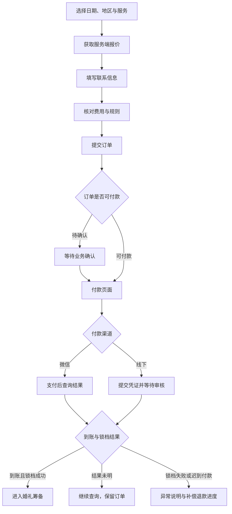

# 微信小程序与管理后台 UI/UX 全面重构设计方案

> 面向彦祖的设计评审与后续实施文档。
>
> 版本：V1.0。日期：2026 年 9 月 15 日。
>
> UI 指界面的视觉与控件呈现，UX 指用户完成任务的整体体验。本方案同时重构信息架构、导航、业务交互、页面布局、视觉语言和异常恢复体验。
>
> 本次交付仅新增文档，不修改业务代码、配置和既有界面改动。本文描述的是目标设计，不代表功能已经开发或上线。

## 一、已确认的方向与设计边界

### 1.1 已确认事项

| 项目 | 已确认的决定 |
| --- | --- |
| 视觉方向 | 现代婚礼品牌：暖白背景、深色文字、克制的香槟色点缀 |
| 用户端 | 完整覆盖浏览、选人、预约、付款、筹备、履约、变更、售后和个人中心 |
| 服务人员端 | 完整覆盖工作台、本人录单、订单履约、档期、结算、资料、作品、套餐与附加项 |
| 管理员端 | 小程序移动管理端与桌面管理后台均纳入完整设计 |
| 本次产出 | 一份可以继续指导原型、视觉设计、开发和验收的方案文档 |
| 代码边界 | 不实施任何代码重构，不覆盖工作区已有修改 |

桌面管理后台指仓库中的 `admin`，不是 `pc` 品牌展示网站。`pc` 的品牌、案例、资讯与联系页不在本次完整重构范围内，后续可以沿用品牌规范。

### 1.2 方案定位

重构后的产品应呈现为一家专业婚礼服务机构的数字化服务空间：用户能够安心选择与推进婚礼，服务人员能够清楚掌握工作与收入，管理员能够迅速识别风险并完成处理。

三类角色共用品牌、基础组件和状态语言，各自采用不同的任务组织方式。暖白与香槟色负责品牌辨识，清楚的任务入口、日期、金额和处理依据负责业务效率。

### 1.3 证据与假设

本方案基于仓库现有文档、页面路由、页面模板及接口声明进行梳理，未进行微信真机操作、线上用户访谈、完整后台点击测试或截图审计。下文“现状”仅指本次查看到的文件事实；体验影响属于需要原型与用户测试验证的设计判断。

统一使用以下标记，防止将目标方案误当成现有能力。

| 标记 | 含义 |
| --- | --- |
| 【重组】 | 已发现相应页面或业务能力，目标是重新安排结构与交互；不等于所有接口字段已验证 |
| 【新增】 | 本轮未确认存在完整能力，需要后续页面、接口、权限或数据建设 |
| 【核验】 | 业务语义、权限或具体交互须在实施前与服务端和产品负责人核对 |

下文所有未标记的视觉尺寸、页面编排、文案和交互规则均为目标规范，不是对现网的完成情况描述。

## 二、现状梳理与重构重点

### 2.1 已有基础

| 已查看的依据 | 观察到的事实 | 对设计的影响 |
| --- | --- | --- |
| `uniapp/src/pages.json`、`uniapp/src/constants/page-contract.ts` | 当前核心底部导航涉及首页、动态、我的；服务人员工作台和管理员看板从个人入口进入 | 要重做任务入口，并明确工作身份与个人消费身份 |
| `uniapp/src/pages/index/index.vue` | 首页已有品牌、媒体展示与装修模块 | 可以保留内容运营能力，但需要固定预约入口与任务优先级 |
| `uniapp/src/pages/staff_list/staff_list.vue` | 筛选摘要修改会进入档期查询；人员列表已有加载、空状态和海报展示 | 目标改为就地修改筛选，减少重复往返；保留已有异常处理基础 |
| `uniapp/src/packages/pages/staff_center/staff_center.vue` | 已有常用操作、待办、近期订单与资料入口 | 重构重点是优先级和日常工作闭环，无需把所有能力重新发明一遍 |
| `uniapp/src/packages/pages/admin_dashboard/admin_dashboard.vue` | 已有指标、今日优先处理、收入趋势、档期占用和团队风险展示 | 增加可追溯的任务列表与处理路径，避免指标停留在展示层 |
| `uniapp/src/packages/common/api/adminDashboard.ts` | 当前查看到的移动管理员接口为概览、收入趋势、订单统计与团队概览 | 移动审核与跨对象待办不能直接当成现有能力 |
| `admin/src/views/order/lists/index.vue` | 订单表存在较多列，固定操作列宽度为 680px，详情使用 800px 弹窗 | 建议收敛列表信息与行操作，完整订单处理改用独立详情空间 |
| `admin/src/views/workbench/index.vue` | 已有指标、待办和图表结构 | 目标围绕婚期风险、待审核与应收组织首页，减少平均分配视觉权重 |
| `docs/服务人员工作台与本人录单.md` | 本人录单已有三步流程、临时联系人、受限报价和收款申请审核 | 必须保留这些边界，不能设计为任意代客改价或自行确认到账 |

### 2.2 优先解决的体验问题

1. 入口按任务重排。用户首先需要知道“我能选谁”和“接下来要做什么”，服务人员首先需要知道“今天有哪些服务”，管理员首先需要知道“哪些事项需要处理”。
2. 让订单成为协作中心。人员、问卷、改期、付款、凭证、售后与通知应能回到同一订单上下文。
3. 将付款、履约、退款和结算分层表达。不能用一个“已完成”标签覆盖所有业务事实。
4. 减少反复筛选、长表单和弹窗叠加。保留列表位置、已选婚期、已填资料与失败恢复路径。
5. 建立全端视觉规则。统一文字、留白、按钮、表单、图片与状态，不让页面各自使用独立的装饰套路。

### 2.3 本次使用的设计方法

本机已读取并应用以下设计 skill 的相关方法；仅将适用部分用于方案设计，不生成实现代码或执行安装。

| Skill | 本次采用的方法 | 对应成果 |
| --- | --- | --- |
| `ux-design` | 先定义角色任务，再绘制路径；覆盖加载、失败、权限、成功与恢复 | 第三至九章的任务流、状态矩阵和页面规范 |
| `cross-platform-design` | 在不同屏幕保留任务目标与状态语义，调整导航、密度和控件组织 | 小程序单列任务流与桌面列表／详情工作区 |
| `web-design` | 桌面后台先确定业务主题，再安排列表、证据和动作；使用克制动效 | 第七章的后台结构及第十章的视觉规范 |

补充采用 `operational-dashboard` 的优先队列与详情下钻方法，以及 `checkout-upgrade` 的费用透明和支付恢复方法。没有将这些方法作为真实用户研究或现网可用性验证的替代品。

## 三、产品设计总纲

### 3.1 角色与核心任务

| 角色 | 使用频率与场景 | 核心任务 | 首屏应回答的问题 | 主要风险 |
| --- | --- | --- | --- | --- |
| 新用户 | 低频，了解与比较 | 找到合适的人员、档期和报价 | 这里能提供什么？我的婚期能预约谁？ | 价格不透明、看不到真实服务信息 |
| 已预约用户 | 婚期临近时高频 | 完成付款、问卷与服务确认 | 婚礼准备到哪一步？现在需要我做什么？ | 错过待办、误解付款与锁档 |
| 服务人员 | 每日，多在手机上处理 | 履约、排期、录单、收款申请与结算 | 今天做什么？下一单在哪里？ | 冲突档期、重复录单、收款归属不清 |
| 管理员移动端 | 碎片时间、异常提醒后 | 看风险、查看依据、处理轻量待办 | 哪件事最急？我是否有权处理？ | 缺少上下文就误操作 |
| 管理员桌面端 | 每日，连续处理 | 客户跟进、调度、财务审核、内容运营 | 当前工作队列是什么？处理结果是否已落地？ | 大量重复操作、金额口径混淆 |

### 3.2 交互决策摘要

| 端 | 主要模式 | 主动作 | 核心路径 | 失败恢复 |
| --- | --- | --- | --- | --- |
| 用户端 | 先浏览，再短步骤确认；预约后使用婚礼进度中心 | 查找可预约人员／完成当前待办 | 婚期地区→选人→选服务→核对报价→订单与付款→筹备履约 | 保留条件、重新报价、主动查询支付结果 |
| 服务人员端 | 今日任务队列＋档期列表＋三步录单 | 处理最紧急待办／录入本人订单 | 今日→订单→查看要求→执行动作→返回队列 | 保留表单、提示冲突、查询提交结果 |
| 移动管理员端 | 风险摘要＋待办列表＋证据详情 | 处理优先事项 | 概览→待办→依据→确认→结果 | 状态过期刷新、权限说明、明确桌面处理路径 |
| 桌面后台 | 队列与详情并行，复杂任务使用独立页面 | 当前队列的业务处理 | 筛选→查看→判断→提交→下一条 | 保留筛选位置、冲突对比、部分失败清单 |

### 3.3 视觉概念：婚礼服务手册

将产品组织为一本可持续推进的“婚礼服务手册”：婚期是时间锚点，服务人员与作品是选择依据，订单时间线是协作记录，凭证与账单是信任依据。

视觉上的记忆点是“日期索引”：订单、今日任务和排期使用同一种日期标识。它帮助识别婚期，不伪装成装饰性日历；同一日期下的工作自然聚合，点日期能够查看对应安排。

| 设计层 | 决策 |
| --- | --- |
| 气质 | 温暖、清晰、有秩序、专业、不过度奢华 |
| 用户端构图 | 真实作品与人物展示＋明确的预约条件＋婚礼时间线 |
| 服务人员构图 | 今日时间轴＋待办队列＋档期与收入入口 |
| 管理员构图 | 婚期风险队列＋处理依据＋经营账目 |
| 重复元素 | 日期索引、细分隔线、同一组状态标签和金额排版 |
| 适度变化 | 用户内容页可以有较大作品图，业务工作区压缩装饰和空白 |
| 不采用 | 全屏金色、全站黑金、毛玻璃堆叠、每块内容都套卡片、自动轮播数字、无业务含义的炫彩图表 |

## 四、全端信息架构与身份切换

### 4.1 用户端底部导航

目标采用四项：**首页、选服务、我的婚礼、我的**。

| 导航 | 承载任务 | 页面组织 |
| --- | --- | --- |
| 首页 | 建立信任、快速开始 | 简洁品牌区、婚期地区入口、服务分类、精选作品、服务保障 |
| 选服务 | 找人与比较报价 | 条件摘要、分类、人员列表、作品、套餐与档期 |
| 我的婚礼 | 推进已建立的服务关系 | 当前婚礼／订单、下一步待办、筹备时间线、服务团队、账单 |
| 我的 | 账号与个人记录 | 收藏、消息、活动、售后、资料、设置、工作身份入口 |

【重组】动态与资讯进入首页的内容区域与“灵感与案例”二级入口，不再占据高频交易导航位置。动态发布、详情、收藏与活动能力保留。

【新增】“我的婚礼”是新的聚合页。第一阶段以单个订单为上下文，不假定系统已存在独立“婚礼项目”对象。多订单时明确选择当前订单，展示人员与订单号摘要。将多个订单正式合并成同一婚礼项目，属于后续数据模型决策。

【核验】新底部导航需要同步小程序路由、页面契约、后台导航装修、分享路径与旧页面跳转。不能只替换导航文字。

### 4.2 服务人员工作区

目标工作导航采用：**今日、订单、档期、我的业务**。录单作为“今日”和订单页稳定的文字按钮“录入订单”；结算在“今日”的收入摘要和“我的业务”首组提供直接入口。

| 导航 | 内容 |
| --- | --- |
| 今日 | 下一场服务、待确认、收款审核反馈、待收款确认、录单入口 |
| 订单 | 待确认、待服务、服务中、尾款待收、已完成、异常与历史 |
| 档期 | 月历、选中日期安排、手动安排、不可接单状态 |
| 我的业务 | 结算、资料、作品、证书、套餐、附加项、动态、确认函 |

【新增】独立工作导航与工作区外壳是目标能力。实现时要先验证微信小程序底部导航机制，不假设可以在原生导航上任意动态切换一套页面。可以使用明确的自定义工作导航，但必须处理安全区、返回、页面栈和选中状态。

### 4.3 移动管理员工作区

目标导航采用：**概览、待办、订单、更多**。

| 导航 | 内容 |
| --- | --- |
| 概览 | 高优先级风险、今日待处理、当前经营摘要、未来服务压力 |
| 待办 | 待审核收款、退款、变更、售后与提醒事项的统一队列 |
| 订单 | 搜索、按婚期或状态筛选、查看订单与履约情况 |
| 更多 | 排期查询、团队、经营报表、消息与管理身份信息 |

【新增】除现有概览外，移动管理员待办、订单管理详情及审核交互均需要新页面，并核验相应移动接口与数据权限。

### 4.4 身份规则

1. 个人消费身份与工作身份明确分开。页面顶部显示“个人服务”“服务工作台”或“管理工作台”，不依赖背景颜色暗示。
2. 多身份账号在“我的”使用“切换工作身份”；只有一个工作身份时直接进入，不增加无意义的选择页。
3. 可以记住上次工作区，但每次进入重新校验权限。权限撤销后清除受限信息，返回可访问入口。
4. 分享或通知链接先确认目标所属角色，再校验对象访问权限。工作订单链接不能静默打开同编号的个人消费订单。
5. 工作人员访问自己的收藏、活动报名、评价和个人售后时，仍进入个人服务场景，并提供正确返回工作区的路径。
6. 切换身份前有未提交表单时提示保留或放弃。返回到表单后重新验证报价、档期和提交资格。
7. 展示某个入口不构成权限授权；任何金额、审核和个人数据动作都由服务端复核。

## 五、用户端完整设计

### 5.1 首页：快速进入选择，而不是阅读整屏宣传

首屏优先级：品牌与服务地区→婚期入口→主要服务分类→一项真实作品或用户待办。品牌大图不占满第一屏；已预约用户优先看到“继续准备婚礼”。

```text
┌──────────────────────────┐
│ 品牌名称                 消息 │
│ 为你的婚礼，找到合适的团队     │
│ 服务地区  选择婚期             │
│          查找可预约人员        │
├──────────────────────────┤
│ 主持／摄影／摄像／化妆等实际分类 │
│ 精选作品：真实婚礼与服务说明    │
│ 预约流程与费用说明             │
├──────────────────────────┤
│ 首页  选服务  我的婚礼  我的    │
└──────────────────────────┘
```

以上为结构草图，不是完成后的高保真界面。服务分类从现有配置读取，不虚构平台已开放的业务。

【重组】首页装修可以调整内容图片、作品集合、栏目文案与排序，但品牌基本信息、预约入口、身份状态和当前关键待办是固定骨架。运营不可把支付提醒插入广告轮播或改变核心导航语义。

无婚期也可以浏览，列表说明“选择婚期后可确认档期”。服务地区加载失败时显示“服务地区暂时无法加载，请重试”，不默认选一个城市继续报价。

### 5.2 选服务：条件在当前页完成

页面顶部展示“地区／婚期／服务类型”条件条，下方为搜索与筛选，主体使用方便比较的单列人员卡。作品内容页可以使用图集，交易列表避免大海报连续占屏。

| 区域 | 必须展示 | 交互规则 |
| --- | --- | --- |
| 条件条 | 地区、日期、时段（有业务支持时） | 点选打开底部面板，确认后刷新列表并保留其他条件 |
| 筛选 | 服务类型、可预约、预算与现有标签 | 已选数量明确；支持逐项移除和清空；高级项渐进展开 |
| 排序 | 综合、价格等已支持维度 | 排序名称与结果一致；不新增虚假推荐评分 |
| 人员卡 | 姓名、服务类别、代表作品、地区、参考价格、档期状态 | 卡片进入详情；收藏按钮独立点击，不误触跳转 |
| 价格 | 起价条件或已选地区报价 | 未选条件时显示“参考价”；报价失效时提示重新计算 |
| 空结果 | 当前条件和可调整项 | 提供改日期、放宽筛选、符合规则时登记候补 |

【新增】收藏对比可以作为第二阶段增强，最多同时对比三位人员，维度只使用真实的套餐、价格、作品、地区与档期信息。没有结构化数据时先采用收藏列表，不生成主观排名。

### 5.3 人员详情：让用户完成判断

顺序为“人物与代表作品→姓名及服务定位→婚期地区与报价→套餐→作品→真实评价→服务说明”。资质与标签是辅助证据，不挤占主要服务内容。

底部主按钮根据上下文显示“选择婚期查看报价”“选择套餐”或“确认服务”，次按钮为“联系顾问”。按钮名称说明下一步，不把创建订单前的动作称作“支付”。

套餐使用纵向列表或可展开的比较条目，列出服务时长、交付内容、包含项、不包含项、地区差价与适用说明。附加项默认不勾选，选择后即时展示价格变化。不可预约时解释对应日期不可约，并提供改期查询与候补入口。

### 5.4 预约与订单确认：三步完成明确承诺

【重组】将现有预约、确认与付款页面组织为三个清楚的步骤，返回上一步保留输入。

| 步骤 | 内容 | 主按钮 | 进入下一步的条件 |
| --- | --- | --- | --- |
| 1．服务安排 | 地区、婚期、人员、套餐与附加项 | 下一步，填写联系人 | 服务可用，报价基础条件完整 |
| 2．联系信息 | 联系人、手机号、必要的场地与服务备注 | 核对订单 | 必填字段通过校验；明确客户主体 |
| 3．核对订单 | 服务摘要、费用明细、付款安排、取消和改期规则 | 提交订单 | 最新服务端报价已确认，必要协议已勾选 |

创建后根据实际业务状态进入“等待确认”或付款页，不假定所有订单可立即支付。第三步展示合同总额、本次应付、后续尾款、付款渠道和锁档条件，页面底部再次展示本次提交的业务含义。



流程图描述目标前台表达。线下审核冲突与微信已实收后的冲突按各自真实业务结果处理，不能统一伪造成“付款失败”。

报价变化：标出变更项、旧金额与新金额，要求再次确认后才能提交。改婚期或地区使旧套餐和报价失效时，先说明影响，再回到对应选择步骤。

### 5.5 付款与结果页

| 场景 | 用户看到什么 | 可执行动作 |
| --- | --- | --- |
| 微信付款前 | 本次阶段、金额、渠道、付款后会发生什么 | 支付本次款项 |
| 用户取消微信支付 | “本次支付已取消”，保留订单 | 继续支付、查看订单 |
| 客户端返回成功但服务端未确认 | “正在确认付款结果” | 查询结果、返回订单；避免重复创建付款 |
| 线下凭证待审 | 金额、归属、提交时间、凭证与待审状态 | 查看申请，不显示“已到账” |
| 凭证被拒绝 | 拒绝原因和上次凭证 | 更换凭证后重新提交 |
| 首笔到账且锁档成功 | “首笔款项已到账，档期已锁定” | 查看婚礼安排 |
| 服务完成，尾款未收 | “服务已结束，待结清尾款” | 按允许渠道完成尾款 |
| 迟到实收或抢档失败 | 实收事实、订单未恢复、退款处理中或对应实际阶段 | 查看退款详情、联系顾问 |

消费者一般支付规则以现有业务为准：定金走微信；启用线下收款时全款与尾款走线下，否则走微信。已存在的付款流水与待审凭证保留原渠道。服务人员本人录单中的收款申请按其专门规则表达，不与消费者通用规则混用。

结果页须同时回答：发生了什么、是否需要我继续操作、下一步在哪里。不得只显示一个大勾和“操作成功”。

### 5.6 我的婚礼：订单驱动的筹备中心

【新增】聚合已有订单、问卷、团队、账单和售后入口。跨接口数据只局部刷新，问卷失败不遮住已成功加载的订单信息。

```text
当前服务：婚期与订单摘要       切换订单
距离婚期：日期信息／已结束说明

下一步：填写新人问卷         去填写
        或：待支付尾款        查看账单

婚礼进度
已预约 ─ 筹备中 ─ 待服务 ─ 已服务
付款进度独立显示：首款／尾款／退款

服务团队                     联系方式
筹备资料与问卷               查看全部
费用与付款记录               查看账单
变更与售后                   发起申请
```

以上草图强调履约与付款两条进度线。“我的婚礼”不是一个将所有状态强行压成百分比的完成度面板。

待办排序：即将影响服务的必需事项→待付款或待处理变更→问卷等筹备事项→评价。任务完成后明确结果，再显示下一项，不在用户点击时突然重排按钮位置。

空状态区分：未登录展示登录后查安排；已登录无订单展示“还没有预约服务”；历史订单展示“服务记录”；多订单显示明确的切换入口。

【新增】问卷按主题分组并支持草稿恢复。现有已提交问卷保持只读，过期或取消任务不能继续提交；草稿与后端版本快照、自动保存能力须专门核验。

### 5.7 改期、暂停、加项、退款与售后

从订单详情进入，自动携带订单上下文。统一采用“选择诉求→填写必要信息→确认影响→提交→进度跟踪”。

| 事项 | 必须说明的影响 | 结果与恢复 |
| --- | --- | --- |
| 改期 | 原日期、新日期、可约情况与可能的价格变化 | 提交只是申请；通过后才能展示新档期已生效 |
| 暂停 | 服务安排与款项的实际处理规则 | 展示暂停申请及结果；恢复入口按真实业务支持开放 |
| 加项 | 新增内容、差额、付款阶段 | 报价改变需要重新确认，申请通过不等于已支付 |
| 退款 | 可退范围、金额、原付款渠道、审核与到账差异 | 展示审核、执行与到账进度，失败提供可追踪的处理说明 |
| 工单／投诉 | 联系方式、问题、附件、受理主体 | 展示处理时间线与回复，避免重复提交同一事项 |
| 回访 | 关联订单、回访内容与实际状态 | 已结束记录只读，不制造新的处理承诺 |

退款与改期规则须来自实际业务配置或协议，不自行加入“免费改期”“立即到账”等承诺。

### 5.8 内容、活动与个人中心

| 页面组 | 重构规则 |
| --- | --- |
| 动态与资讯 | 保留来源、作者、日期与媒体；作品和人员可关联时提供明确跳转；发布失败保留内容 |
| 活动与报名 | 费用、名额、时间、地点、截止时间和取消规则在报名之前可见；提交后展示报名结果 |
| 收藏 | 按人员与内容分类；下架项目保留必要说明并提供移除，不出现无反馈空白 |
| 评价 | 从已完成订单进入；展示评价对象与隐私范围；图片上传逐项反馈 |
| 消息 | 按业务类型与未读筛选，消息详情回到对应对象；失效对象解释原因 |
| 我的 | 头像与账号、个人记录、通知设置、工作入口、隐私与协议；减少大头像装饰和重复菜单 |
| 登录与绑定 | 浏览可免登录；收藏、预约、查看个人信息等需要身份的动作再提示，并完成后返回原任务 |
| 服务号通知 | 分开展示是否关注、是否绑定、是否可接收；允许跳过，不阻断预约和付款 |

## 六、服务人员端完整设计

### 6.1 今日工作台

工作台先显示下一场服务与今日待办，再显示常用操作和收入摘要。头像、等级与宣传信息移到“我的业务”。

```text
服务工作台     当前工作身份       消息
今天 09 月 15 日                  录入订单

下一场服务
日期与时间／服务地点／订单联系人
当前状态                         查看订单

待办
待确认订单                       2 项
收款申请被退回                   1 项
待确认收款                       1 项

今日安排：按实际服务时间排序
收入摘要：待结算／待确认／已到账

今日       订单       档期       我的业务
```

数量仅为结构示例，不代表真实经营数据。若接口不提供服务时刻，按服务日期组织，不能编造具体到场时间。

优先级由业务配置确定：临近服务且待确认、影响履约的变更、收款申请退回、待确认结算、一般资料事项。金额为零时显示零，数据加载失败时显示“暂未获取”，两者不可混同。

### 6.2 订单列表与详情

列表每行展示服务日期、客户称呼、服务类型、地点摘要、履约状态和当前动作。付款状态使用独立标签。服务人员只看到本人范围内的记录，搜索不能跨越数据权限。

详情顺序：当前状态与下一步→服务信息→客户联系→套餐要求→问卷与资料→金额及收款申请→操作记录。

| 当前任务 | 主动作 | 操作要求 |
| --- | --- | --- |
| 待确认服务 | 确认安排 | 展示日期、地点与冲突提示；确认后刷新本人档期 |
| 待开始服务 | 开始服务 | 仅在服务端允许时显示；按原有流程确认 |
| 服务中 | 完成服务 | 说明完成后尾款与订单状态的变化，不等同于账务全部结清 |
| 允许申请收款 | 提交收款申请 | 选择允许的阶段、真实归属、上传凭证 |
| 收款申请待审 | 查看审核进度 | 暂不提供重复申请或自行改为已收款 |
| 收款申请被拒绝 | 修改后重新提交 | 显示处理原因及历史凭证 |
| 需提供确认函 | 生成／查看确认函 | 使用现有可用配置，版本与生成结果清楚可见 |

客户手机号与问卷等信息按角色权限显示。拨打电话是用户主动动作，不自动发起联系。

### 6.3 本人录单：保留约束，降低填写成本

【重组】保留现有三步结构，优化段落、字段依赖与摘要。

| 步骤 | 内容与规则 |
| --- | --- |
| 1．客户与日期 | 完整手机号精确查找，明确选择匹配客户；无账号时可以选择临时联系人；日期、地区与联系人分别成组 |
| 2．本人服务 | 仅展示本人套餐与附加项；价格由服务端计算；日期或地区变化后重选失效服务并获取新报价 |
| 3．核对与收款安排 | 展示客户主体、地区婚期、费用拆分、付款安排；按需提交凭证和收款归属 |

底部持续显示“第几步／共三步”及当前主按钮。返回前一步保留内容；退出提示有未提交内容；上传错误保留其余字段。

必须保留的现行业务边界：

1. 临时联系人仅支持线下收款，不自动创建、关联或认领客户账号。
2. 关联客户可以按现行规则选择线上待付款或线下收款。
3. 服务人员不能选协作人员、改价、优惠或把订单直接登记为已付款。
4. 收款归属默认为“人员代收”，也可以选择“平台收款”；提交前明确显示归属及其影响。
5. 收款申请提交后显示“等待审核”。首笔审核通过后才按实际结果入账并锁档。
6. 查询客户凭据失效后重新确认客户，不擅自切换为临时联系人。
7. 重试建单使用原提交上下文并查询结果，不能因网络错误重复创建订单。
8. 服务号提醒可跳过；主动查看绑定方法返回后，原表单仍可继续。

【新增】跨次启动恢复录单草稿需要独立设计保存范围、有效期、退出登录清理和重新报价机制。第一阶段至少保证当前填写会话内的返回与失败不丢内容。

### 6.4 档期：月历看分布，列表看具体任务

上方月历负责定位日期，下方展示选中日的订单和手动安排。日期状态用文字或形状辅助颜色识别，图例始终可见。

| 情况 | 目标表达 |
| --- | --- |
| 可预约 | 中性日期＋可约说明 |
| 已锁档 | 明确标记“已锁档”，点击查看对应有权限的订单 |
| 手动安排 | 标记“手动安排”，与正式订单来源区分 |
| 不可接单 | 灰色状态＋“不可接单”文字，不与加载失败混同 |
| 冲突 | 展示冲突日期与具体安排，拒绝静默覆盖 |

【核验】视觉状态以真实档期数据模型为准。“手动安排”不是虚构的已付订单，“不可接单”不能作为取消正式订单的替代操作。

月视图切换与列表返回保留当前月份、选中日期和滚动位置。编辑安排前展示影响范围。连续日期批量设置作为【新增】能力，需要明确部分日期失败的反馈与权限规则。

### 6.5 结算：金额必须可解释

顶部摘要使用“待结算”“待确认收款”“已到账”“待补交平台款”，按真实数据分别呈现，避免统称为“余额”。

每条结算显示关联订单、结算周期、服务收入、抽成或扣项、代收归属、应得／应补金额、转账状态与明细入口。展示净额时同时允许查看计算依据。

| 转账阶段 | 页面表达 | 主动作 |
| --- | --- | --- |
| 待发起 | 等待平台发起结算 | 查看明细 |
| 转账中 | 正在处理 | 查询结果 |
| 待用户确认 | 请确认收款 | 进入受支持的确认流程 |
| 已到账 | 已到账，并展示实际时间 | 查看记录 |
| 失败或关闭 | 原因与当前可执行动作 | 刷新状态／联系平台 |

结算结果从微信或外部确认页返回后主动同步。不因客户端返回或按钮点击直接展示“到账”。平台款补交仍走现有专门支付来源，与普通订单付款区分。

### 6.6 我的业务

| 模块 | 设计 |
| --- | --- |
| 个人资料 | 对外展示与内部信息分组，审核状态显示在提交处 |
| 作品 | 列表预览、封面选择、上传进度、逐项失败重试；客户资料隐私提示放在发布前 |
| 证书 | 有效状态、审核结果、必要的有效期；不虚构认证标记 |
| 套餐 | 服务内容、适用地区、价格与上架状态分组；修改影响历史订单的规则明确 |
| 附加项 | 价格、内容和可选范围；保存后给出具体结果 |
| 动态 | 草稿与发布结果明确；删除前展示影响 |
| 确认函 | 配置、预览、生成、历史版本和保存文件区分；生成失败可重试 |

## 七、管理员移动端与桌面后台完整设计

### 7.1 两端分工

两端共享任务状态、金额口径与权限规则。移动端完整承接查看、筛选、轻量处理和结果追踪；桌面承接长表格、批量任务、复杂财务、配置和内容编排。

| 工作 | 移动管理员目标 | 桌面后台目标 |
| --- | --- | --- |
| 风险和待办 | 按优先级查看与进入详情 | 完整队列、负责人、筛选、批量指派 |
| 订单 | 查询、查看、受控的单条操作 | 完整编辑、录单、复杂变更与履约操作 |
| 收款审核 | 具备证据与权限时单条审核【新增】 | 完整审核、历史对照、异常处理 |
| 退款 | 查看进度；简单审批经核验后开放 | 分流水执行、失败核对和线下实际退款凭证 |
| 排期 | 查日期、查人、看冲突 | 人员×日期排期、规则、手动安排与候补 |
| 客户跟进 | 查看联系与待跟进摘要；受控记录【新增】 | 客户全貌、分配、跟进历史、流失预警 |
| 内容与配置 | 查看发布结果和风险提醒 | 编辑、审核、预览、发布及权限管理 |
| 财务报表 | 核心指标与明细查询 | 流水、结算、应收、月报与导出 |

第一阶段未开放的移动动作要清楚标明“请在桌面后台处理”，并给出订单号、任务类型与后台菜单路径。它是阶段性过渡，不算移动完整处理能力已经完成。

### 7.2 移动概览：先处理，再分析

```text
管理工作台                    消息
今日／本周／本月       数据更新时间

优先处理
临近婚期仍待确认               查看任务
待审核收款                     查看任务

今日服务安排                   查看全部

经营摘要
已实收／待收尾款／退款处理中

近期趋势与档期压力             查看明细

概览       待办       订单       更多
```

时间筛选影响经营分析区；待办区默认显示当前尚未完成的任务，注明“当前待办，不受统计周期限制”。不能让本月筛选悄悄隐藏上月创建但仍未处理的退款。

每项风险必须有可解释来源：关联对象、日期、触发原因和更新时间。没有已定义的业务规则时不生成“高风险评分”。

### 7.3 移动待办与审核详情

【新增】统一待办条目至少包含类型、对象、优先级、等待时长、婚期、负责人、当前状态与详情入口；跨对象优先级和时限属于可配置规则。

收款审核页按以下顺序组织：

1. 审核对象：订单、客户、服务人员、申请人、申请时间。
2. 申请依据：阶段、申请金额、当前应收、收款归属、凭证。
3. 风险核对：是否本人提交、是否已处理、是否档期冲突、当前允许操作。
4. 历史信息：此前申请、拒绝原因、已有付款记录。
5. 操作区：通过与拒绝；拒绝原因必填；通过前复述金额、归属与锁档影响。
6. 完成反馈：展示实际审核结果及订单变化，返回原队列并保留位置。

多人同时处理时，旧页面提交必须返回“此申请已处理”，展示新状态而不是覆盖。对于证据不足的申请，不让审核人凭一个缩略图直接完成审核。

### 7.4 桌面后台导航重构

一级导航按运营任务组织，常用队列允许收藏；不按接口控制器名称暴露菜单。

| 一级导航 | 二级模块 | 首要任务 |
| --- | --- | --- |
| 工作台 | 今日待办、婚期风险、我的跟进、经营摘要 | 处理当天任务 |
| 客户与跟进 | 客户、顾问、跟进记录、流失预警 | 从咨询推进到成交与服务 |
| 订单与履约 | 全部订单、待确认、待收款、变更、退款、服务进度 | 按订单完成业务 |
| 排期与团队 | 全局日历、人员、团队、档期规则、吉日、候补 | 保证人员与婚期安排可靠 |
| 财务 | 收款审核、流水、应收、退款执行、结算、单量月报 | 对账、审核与结清 |
| 服务与内容 | 服务分类、地区、套餐、作品、动态、资讯、活动、评价、问卷 | 管理可售服务和真实内容 |
| 售后 | 工单、投诉、回访及其受理队列 | 处理服务问题 |
| 运营工具 | 素材、档期海报、确认函相关工具、图片与视频工具 | 生成与维护业务素材 |
| 设置 | 员工账号、角色权限、组织、渠道、通知、装修、支付配置、系统日志 | 管理规则与基础能力 |

这里是目标菜单归类，具体能力沿用现有实现并逐项核验。角色看不到无权限模块；开发工具、示例组件页不作为日常业务入口。既有桌面 `staff_center` 类页面保留本人业务权限，可归为“我的工作”，不能因为共用后台外壳就获得管理员范围。

### 7.5 桌面总体布局

在宽屏使用固定导航、主工作区和按需出现的详情侧栏。工作台以队列为主体；数据分析页面以图表和可核对明细为主体；不强求所有页面使用同一排版。

```text
┌────────┬──────────────────────────────────────┐
│ 品牌   │ 当前模块／路径       对象搜索／消息／账号 │
│        ├──────────────────────────────────────┤
│ 工作台 │ 婚期风险与当前待办摘要                  │
│ 客户   ├──────────────────────┬───────────────┤
│ 订单   │ 我的队列             │ 选中任务的依据 │
│ 排期   │ 筛选／保存视图        │ 订单摘要       │
│ 财务   │ 按时限与婚期排序      │ 凭证／记录     │
│ 内容   │ 任务列表             │ 当前可用动作   │
│ 售后   ├──────────────────────┴───────────────┤
│ 设置   │ 最近处理结果／局部异常说明               │
└────────┴──────────────────────────────────────┘
```

以上为任务工作区结构草图。全局对象搜索、保存视图与统一待办属于【新增】目标，必须由具备数据权限的查询接口支持。

### 7.6 订单中心

**列表。** 默认展示订单号／客户、婚期、服务人员、履约状态、付款状态、待处理事项和精简操作。搜索支持订单号及权限内的客户信息；常用筛选直接显示，其他字段进入“更多筛选”。

固定行操作仅保留“查看”及一个当前最相关动作，其余放入有文字的“更多”。不可执行动作隐藏或明确说明原因，不能用一长排列按钮占据半个表格。

【新增】保存视图建议包括“临近婚期待确认”“收款待审”“服务结束未结尾款”“退款待执行”。视图的筛选条件可检查、可修改，名称不替代真实规则。

**详情。** 快速查看使用右侧详情栏；涉及多阶段财务或完整编辑时进入独立详情页。结构为订单摘要、服务安排、付款与凭证、变更与售后、问卷资料、操作记录。

页面右侧或顶部动作区只呈现当前角色与状态允许的动作。离开详情回列表保留筛选、页码、排序和位置；更新成功后只刷新受影响记录与计数。

**录单。** 桌面录单使用“客户与服务→费用与安排→核对提交”宽屏步骤页。管理员是否可改价、协作人员和直接确认收款，依据现有独立权限，不从服务人员端推导。临时联系人和正式客户的主体区别始终可见。

### 7.7 客户与跟进

客户详情围绕“当前需求、婚期地区、负责人、下一次跟进、关联订单、历史记录”组织。列表最重要的是当前阶段、下一步和到期时间，不把所有备注铺在表格中。

新增跟进使用侧栏或轻量表单，记录方式、内容、下一次跟进时间与负责人。保存后返回客户时间线。已有字段以接口为准，提醒、逾期和自动排序规则属于【核验】或【新增】。

客户分配前显示对象数量、当前归属与新负责人；批量操作执行后返回成功／失败清单。咨询主体、临时联系人和登录账号不可仅凭相同姓名或手机号自动合并。

流失预警说明触发原因，例如“超过配置时限未跟进”，不要输出没有依据的“成交概率”。

### 7.8 排期与团队

桌面默认提供人员×日期的排期视图，并提供列表替代，方便小屏和辅助技术使用。固定人员列与日期表头，滚动限制在排期区域内。

点击安排打开详情，先查看订单或手动安排，再编辑。拖动改期如后续开放，属于【新增】高风险交互：必须进行可约检查、价格影响确认和最终提交，不能拖动即生效。

团队详情聚合成员、可服务地区、公开内容、近期安排及资质状态。档期满员或规则限制时展示原因；候补转正式预约必须重新核验档期和报价，不承诺登记候补即保留位置。

档期海报与确认函提供生成前预览、数据日期、版本、生成状态、下载与重试。批量导出或生成任务如采用后台队列，要显示实际已完成数量与失败项，不能显示虚假的百分比进度。

### 7.9 财务：收款、退款、结算分区处理

| 子模块 | 主视图 | 关键交互 |
| --- | --- | --- |
| 收款审核 | 待审队列＋凭证对照区 | 核对应收、阶段、归属、申请人；不允许审核本人申请 |
| 流水 | 可筛选的逐笔账目 | 订单、渠道、实收、退款与时间相互关联 |
| 应收 | 未收金额与付款阶段 | 区分首款未收和服务后尾款；下钻到原订单 |
| 退款 | 主单＋原付款流水拆分项 | 审核与实际执行分开；查看失败原因和渠道结果 |
| 结算 | 按人员与周期的结算列表 | 查看代收、抽成、应得／应补与真实转账状态 |
| 单量月报 | 明确统计口径的月度汇总 | 查看构成明细与导出范围，不将单量等同收入 |

退款失败重试前先核对渠道结果。线下退款完成必须有实际退款记录和凭证。存在退款占用时，不允许通过界面绕过互斥规则发起结算。

移动端可以完成经过权限与证据核验的单条收款审核；拆分退款、复杂账务修正和批量结算优先在桌面完整处理。若业务希望进一步开放移动操作，应增加独立风险评审和验收用例。

### 7.10 内容、服务、活动与问卷

| 模块 | 目标布局与流程 |
| --- | --- |
| 服务分类、地区、套餐与附加项 | 列表管理＋分组编辑；上架状态、价格适用范围和关联对象明确 |
| 人员作品、动态、资讯与评价 | 内容预览、作者、状态与审核依据；审核失败说明修改点；图片缺失可定位 |
| 活动 | 基础信息、报名规则、人员名单与活动结果分区；容量和截止规则提前可见 |
| 新人问卷 | 题库、模板、任务与答案分开；发布新版本不改写已派发任务快照 |
| 素材库 | 搜索、分类、引用位置、预览与上传结果；删除前提示使用关系 |
| 页面装修 | 页面结构、内容编辑、预览三部分；核心业务骨架锁定，避免误删预约与状态入口 |

【新增】装修的草稿、版本回退、多设备预览和发布前差异确认建议成套建设；未验证已有接口前，不能把“撤销发布”画成无条件可用。

### 7.11 售后工作区

采用“待受理→处理中→等待补充→已结束”的任务视图理念，最终标签映射以实际工单、投诉与回访状态为准，不凭方案新增业务状态。

详情显示问题、关联订单、付款摘要、附件、沟通记录、负责人和下一步动作。需要退款时明确进入关联退款流程，不把售后结案直接当成退款到账。

【新增】统一负责人、处理时限、逾期排序和跨工单关联需核验数据基础。缺少时限配置时展示等待时间，不自行定义超时违规。

### 7.12 设置、通知与权限

设置按“组织与账号、服务规则、渠道与支付、通知、展示装修、系统运维”分组。编辑重要配置前展示适用范围，保存成功后说明是否立即生效及是否影响已有记录。

权限编辑同时呈现功能权限和数据范围，例如“可以审核收款”与“可以查看哪些订单”。禁止以一个“管理员”标签概括全部权限。

服务号配置与业务通知区分发送事件、接收资格、发送结果和失败原因。通知投递失败不能反向显示订单失败。系统日志、任务运行结果与业务操作记录保持可追溯。

### 7.13 经营指标的目标口径

以下是建议展示口径，实施前由财务和服务端确认并映射到真实字段，不假定现有 `incomeTrend` 就采用这些定义。

| 指标 | 建议口径 | 禁止混淆 |
| --- | --- | --- |
| 订单应收 | 指定范围内订单的应收口径，并注明是否包含取消或退款订单 | 不称作已收收入 |
| 已实收 | 指定到账时间范围内成功实收，明确收款归属 | 人员代收不直接计为平台银行到账 |
| 退款支出 | 指定实际完成时间内的退款 | 申请金额不等于实际退款 |
| 净收款 | 同一时间与归属范围内的实收减实际退款 | 不直接称作利润或会计收入 |
| 尾款待收 | 当前服务后仍未结清尾款的应收余额 | 不套用首款未付超时取消规则 |
| 档期占用率 | 已占用可售档位／可售档位，注明时间、人员及禁用日规则 | 分母为零显示“不适用” |
| 结算到账 | 实际已到账的转账 | 转账中、待确认均不算到账 |

图表使用真实时间轴、单位、零值和无数据状态。同比或环比缺少基期时显示“暂无可比数据”。点击图表带入同一日期、归属和筛选范围的明细。

## 八、统一状态与业务文案

### 8.1 一个对象可以有多条状态线

| 维度 | 示例 | 呈现原则 |
| --- | --- | --- |
| 订单履约 | 待确认、待服务、服务中、服务已结束、已取消、已暂停 | 说明服务进度 |
| 付款 | 首款待付、首款已收、尾款待收、已结清 | 说明钱款进度 |
| 凭证 | 待审、通过、拒绝 | 说明证据审核，不替代付款事实 |
| 变更 | 申请中、已通过、已拒绝 | 说明变更是否生效 |
| 退款 | 待审核、退款中、已退款、失败 | 区分审批、执行与到账 |
| 结算 | 待发起、转账中、待确认、已到账、失败、关闭 | 说明人员结算阶段 |

现有订单状态值 `1` 同时可能用于首款待支付和服务完成后的尾款待收。界面必须结合付款阶段、服务完成信息与未收金额判断文案，不能只按一个整数映射标签。

已评价、用户已删除、退款中等当前存在的订单标签在迁移时保留正确语义，不能把本表当成完整后端枚举直接覆盖。

### 8.2 全局异常与恢复规范

| 状态 | 目标呈现 | 恢复动作 |
| --- | --- | --- |
| 首次加载 | 与最终结构一致的静态骨架 | 超时后明确重试 |
| 刷新中 | 保留已有数据，标记刷新状态 | 成功局部更新，失败保留旧数据并注明时间 |
| 空数据 | 解释为什么为空 | 提供相应创建或浏览入口 |
| 筛选无结果 | 展示当前筛选条件 | 清除某项或恢复默认 |
| 局部失败 | 错误放在失败模块 | 局部重试，不封锁全页 |
| 数据过期 | 显示更新时间和刷新提示 | 关键提交前重新校验 |
| 无权限 | 解释权限或身份原因 | 返回可访问页／联系管理员；不泄露对象详情 |
| 登录失效 | 保留安全的任务上下文 | 登录成功返回原目标并重新校验 |
| 上传失败 | 每项标记错误原因 | 单项重试、替换、移除 |
| 提交结果未知 | “正在确认提交结果” | 查询原业务对象，避免重复提交 |
| 报价变化 | 显示差异 | 重新确认，不静默接受 |
| 档期冲突 | 展示所选日期与冲突事实 | 改日期／返回选择／查看实际退款流程 |
| 已被他人处理 | 展示当前结果 | 刷新详情，不覆盖新状态 |
| 长任务 | 显示真实阶段或完成数量 | 允许时取消、重试或返回后继续查询 |

### 8.3 关键文案示例

| 位置 | 推荐文案 |
| --- | --- |
| 凭证提交后 | “收款申请已提交，审核通过后更新付款状态。” |
| 微信结果查询中 | “正在确认付款结果，请稍后查看订单。” |
| 尾款待收 | “服务已结束，还有尾款待结清。” |
| 报价过期 | “所选地区或服务价格已更新，请确认最新费用。” |
| 问卷过期 | “这份问卷已过期，请联系顾问获取新的填写安排。” |
| 服务号已绑定但未关注 | “账号已关联，重新关注服务号后可核验通知接收状态。” |
| 转账待确认 | “平台已发起转账，请完成收款确认。” |
| 权限失效 | “当前工作身份已不可用，请返回个人服务。” |

错误文案说明问题和下一步；正常浏览页不展示接口名、鉴权模型或后端状态编号。

## 九、微信小程序与桌面交互细则

### 9.1 微信小程序约束

1. 自定义导航读取实际状态栏、胶囊位置与安全区，不写死机型高度。标题和返回键避开微信胶囊。
2. 底部操作区预留安全区；键盘弹出时当前输入与下一步按钮不能被遮挡。
3. 日期、地区和筛选使用底部面板；复杂订单核对使用整页。原则上同一时刻只显示一个业务弹层。
4. 从微信支付、授权、服务号绑定或文件预览返回时，恢复原任务并查询最新状态。
5. 返回链路覆盖普通进入、分享直达、通知直达、身份切换与页面栈为空。已有订单详情兼容跳转保留正确业务对象。
6. 不把停留在某页面当成已读、已同意或已完成服务。协议和高风险确认均由明确动作完成。
7. 功能开关关闭、审核模式或受限环境下，入口与实际能力一致，提供可理解的替代路径。
8. 时间展示、最早可选日期与婚期计算统一按北京时间业务规则处理，跨零点重新验证日期。

### 9.2 表单统一规则

字段标签常驻，不只用输入框占位文字。必填与选填明确；错误出现在字段附近，提交后滚动到首个错误。依赖字段变化时说明失效内容。

先展示必需信息，再展开备注、附件和高级项。金额由服务端提供时不做可编辑假象；手机号查询必须有清楚的查询动作与结果选择。重复点击进入提交中状态，但恢复路径以服务端结果为准。

【新增】需要跨会话草稿的表单须记录更新时间和版本，返回时明确“已恢复未提交内容”。退出登录、账号切换与设备共享场景清理敏感草稿。

### 9.3 桌面高频操作

搜索支持回车提交，筛选支持明确重置；焦点顺序跟随视觉顺序。弹窗关闭后焦点回到触发按钮，抽屉提供关闭按钮和明确标题。

批量操作显示选择范围、数量和作用对象。“当前页全选”与“筛选结果全选”必须分别表达。没有服务端支持时不提供跨页全选。

复杂财务动作不默认批量执行；后续开放时增加逐项资格核验和结果清单。多个表单层层弹窗的流程改为独立任务页，避免用户失去上下文。

## 十、视觉设计系统

### 10.1 语义颜色

以下为建议色值，语义名称用来说明颜色用途。实施时映射到现有主题系统，不在每个页面单独硬编码。

| 语义 | 建议值 | 用途 |
| --- | --- | --- |
| 页面背景 | `#F7F5F1` | 全端主背景 |
| 主表面 | `#FFFEFB` | 表单、必要的内容容器 |
| 次表面 | `#EFEAE2` | 分组背景与选中辅助底色 |
| 主要文字 | `#25231F` | 标题、正文、重要金额 |
| 次要文字 | `#68625B` | 辅助说明与时间 |
| 装饰分隔 | `#E2DCD2` | 非交互区域分隔 |
| 控件边界 | `#8A8175` | 需要明确辨识的输入边界与焦点辅助 |
| 香槟点缀 | `#C5A572` | 小面积日期标记、装饰线，不直接承担小字号正文 |
| 强调文字 | `#7A592B` | 浅背景上的品牌强调、选中标签文字 |
| 主按钮 | `#25231F` | 主要动作，配浅色文字 |
| 成功 | `#236447` | 成功状态，配文字与图形 |
| 警示 | `#8A570E` | 需要关注，配浅底与明确文案 |
| 错误 | `#B33731` | 错误与危险动作 |
| 信息 | `#315F7B` | 中性提示与处理中状态 |

香槟色不作为白底小字或白字按钮的默认底色。颜色搭配要在实际字号、透明度和背景下核验对比度；装饰分隔线不能替代可识别的输入框边界。

默认优先完成浅色主题。深色主题属于后续成套设计范围，如保留现有多主题切换，则每个主题必须覆盖完整组件与状态，不能只替换几个主色。

### 10.2 字体与信息层级

| 角色 | 小程序建议 | 桌面建议 | 规则 |
| --- | --- | --- | --- |
| 品牌／内容主标题 | 24～28px | 28～32px | 可使用有授权的思源宋体展示字体，仅用于少量标题 |
| 页面标题 | 20～24px | 22～26px | 深色、中等偏粗 |
| 区块标题 | 17～18px | 16～18px | 用字号与间距区分，不重复加边框 |
| 正文 | 15～16px | 14～16px | 中文行高约 1.5～1.7 |
| 辅助说明 | 13～14px | 12～14px | 不承载必须阅读的金额与主要操作 |
| 关键数字 | 24～32px | 24～36px | 同列使用等宽数字，金额右对齐 |

小程序正文使用系统中文字体以保证加载和平台适配；桌面优先有授权的思源黑体及可靠中文回退。品牌展示字体不能使按钮、日期和金额难以阅读，也不加载完整大字体文件阻塞小程序首屏。

文档中的尺寸按逻辑像素给出。在 375px 设计基准下，1px 通常对应 2rpx；rpx 是小程序随屏幕宽度换算的相对单位。开发时分别评估文字、固定控件和响应式间距，不能机械缩放全部尺寸。

### 10.3 间距、圆角与层级

| 项目 | 规范 |
| --- | --- |
| 间距基础 | 4、8、12、16、24、32、48px |
| 小程序横向边距 | 常规 16px，内容展示页可局部满幅 |
| 桌面工作区边距 | 常规 24px，紧凑数据区域 16px |
| 页面区块间距 | 24～32px；同组字段 12～16px |
| 输入和按钮圆角 | 8～10px |
| 主要内容容器圆角 | 12～16px；长表格不必套圆角大卡片 |
| 阴影 | 仅用于弹层、悬浮操作和必要层级，普通列表优先使用分隔线 |
| 触控目标 | 手机主要可点击区域至少 44×44px，主按钮高 48px 左右 |
| 桌面控件 | 常规高度 36～40px；紧凑模式不缩小正文可读性 |

同一页面用标题、留白、分隔和对齐组织信息。卡片只用于独立对象或需要界定的交互区域，不在卡片里继续叠多层卡片。

### 10.4 组件规范

| 组件 | 统一规则 | 必须覆盖的状态 |
| --- | --- | --- |
| 页面头部 | 标题、返回、少量上下文动作 | 普通进入、分享进入、无返回栈 |
| 主按钮 | 一个主要动作，文案表达结果 | 默认、按下、禁用、提交中 |
| 次按钮 | 降低视觉权重但保持可辨识 | 默认、按下、禁用 |
| 状态标签 | 文字＋必要图形＋语义色 | 正常、处理中、警示、错误、中性 |
| 筛选条 | 展示当前条件与数量 | 未选、已选、无结果、加载失败 |
| 人员卡 | 稳定的人员／价格／档期信息顺序 | 加载、可约、不可约、下架、图片失败 |
| 订单卡 | 日期、服务、履约与付款分层 | 当前、历史、异常、待办 |
| 金额摘要 | 应收、实收、待收分开 | 正常、未获取、需重新报价 |
| 日历单元 | 今天、选中、业务状态分别编码 | 可约、占用、不可约、冲突、未知 |
| 上传组件 | 独立项反馈与预览 | 上传中、成功、失败、重试、删除 |
| 确认对话框 | 对象、影响、明确按钮文案 | 普通确认、危险确认、提交失败 |
| 桌面表格 | 稳定列宽、数值右对齐、局部横滚 | 加载、空、排序、选择、局部更新 |
| 时间线 | 事实、时间、操作者与结果 | 已发生、待处理、失败，不虚构未来完成时间 |

后续以已有 `BaseButton`、`BaseCard`、`BaseInput`、`BaseScheduleCalendar`、`StatusBadge`、`OrderCard`、`StaffCard` 等为迁移起点，先评估组件契约，再决定保留或替换。不要再并行创建第三套相似基础组件。

### 10.5 图片、图标与品牌素材

用户端采用真实、有使用授权的婚礼作品与人员照片。封面建议 4∶3，人物可使用 3∶4，详情图保持原始主体完整。裁切规则保护面部、服装和关键服务细节。

后台以缩略图辅助辨识，点击才能查看完整证据。收款凭证预览必须支持放大、原比例和足够分辨率，不能沿用作品卡片裁切。

图标使用统一线性风格与线宽，重要动作配文字，避免把花朵、钻石、戒指等装饰图标用于每个业务菜单。未取得的真实案例、资质和评价不使用生成图片或虚构文案替代。

### 10.6 动效与性能

按钮反馈约 100～160ms，面板开合约 180～240ms，局部状态切换约 160～220ms。动效用于解释展开、选择和状态变化；订单、支付和审核页面不使用数字滚动、页面入场遮罩或视差滚动。

尊重减少动态效果的系统偏好；减少动画时仍保留清楚的静态状态。列表请求时避免整体抖动，骨架尺寸接近最终内容。首屏之外的作品延迟加载，上传与导出使用真实进度或明确阶段。

建议性能预算：可交互控件即时反馈；普通目标网络下关键首屏可用时间以 2.5 秒作为优化目标，并在实施前记录真实基线。弱网不承诺固定完成秒数，超过等待阈值展示可恢复提示。小程序主包与分包体积以当期微信限制和项目现有检查脚本共同验收。

### 10.7 无障碍与适配

以 WCAG AA（网页内容无障碍指南的中等级别）作为颜色与基础交互参考：常规文字对比度至少 4.5∶1，大字至少 3∶1，关键控件边界和焦点至少 3∶1。具体是否达标需要对最终实现检查，本文不宣称已通过。

状态不只依赖红绿颜色。图标按钮有可读名称，字段有常驻标签，图片有合理说明。桌面支持键盘焦点、回车和关闭弹层；小程序在微信 iOS、Android 真机检查朗读顺序、字体放大、键盘与安全区。

| 宽度场景 | 布局要求 |
| --- | --- |
| 手机 320～430px | 单列，主要动作可触达，长姓名与金额不溢出，面板可滚动 |
| 平板／窄桌面 768～1199px | 折叠侧栏，详情按需覆盖，表格局部滚动 |
| 桌面 1200～1599px | 主工作区＋可选详情侧栏，避免固定过宽操作列 |
| 宽屏 1600px 及以上 | 提高可见任务量；表单限定舒适阅读宽度，不无限拉宽字段 |

## 十一、页面迁移与覆盖清单

以下按现有路由族或后台模块映射到目标体验。路径用于定位现状，不要求新版本继续采用同一页面拆分。

### 11.1 小程序用户页面

| 现有页面／路由族 | 目标位置 | 处理 |
| --- | --- | --- |
| `pages/index`、`pages/splash` | 首页与启动体验 | 保留品牌，弱化阻断型启动展示 |
| `pages/schedule_query`、`pages/staff_list`、`packages/pages/search` | 选服务 | 合并条件编辑体验，保留分享兼容 |
| `packages/pages/staff_detail`、`staff_work_detail`、`staff_booking` | 人员详情、作品与预约步骤 | 重排选择依据与预约路径 |
| `packages/pages/order_confirm`、`payment_result` | 核对订单与付款结果 | 明确阶段、金额和结果恢复 |
| `pages/order`、两处订单详情路径 | 我的婚礼与订单详情 | 保留旧详情跳转，新增聚合入口 |
| `packages/pages/couple_questionnaire/*` | 婚礼筹备资料 | 分组填写、只读终态、草稿能力另行建设 |
| `packages/pages/order_change/*` | 订单变更 | 统一影响确认与进度追踪 |
| `packages/pages/aftersale/*` | 订单售后及个人记录 | 覆盖工单、投诉、回访的列表、创建和详情 |
| `packages/pages/review/*` | 评价 | 对象、状态、附件与发布结果统一 |
| `pages/dynamic*`、`packages/pages/dynamic*` | 灵感与动态 | 统一列表、详情和发布，核验重复详情入口 |
| `pages/news`、`packages/pages/news_detail` | 资讯 | 统一阅读与返回体验 |
| `packages/pages/my_activity`、`activity_registration/*` | 活动与报名记录 | 保留报名结果与异常状态 |
| `packages/pages/waitlist` | 候补 | 从无可约结果进入，解释候补不等于锁档 |
| `packages/pages/collection`、`staff_favorite` | 收藏 | 聚合入口，区分人员与内容 |
| `packages/pages/notification`、`pages/oa_subscribe` | 消息与通知设置 | 分清站内消息和服务号接收资格 |
| `pages/user`、`user_data`、`user_set` | 我的与个人设置 | 身份入口、账号和个人业务记录分组 |
| `pages/login`、`register`、`forget_pwd`、`change_password`、`bind_mobile` | 身份与账号恢复 | 任务后置登录、返回原任务、字段校验 |
| `packages/pages/customer_service`、`agreement`、`pages/as_us` | 顾问、协议、关于我们 | 统一可信信息与阅读体验 |
| `pages/webview`、`empty`、`packages/pages/404` | 外部内容与通用兜底 | 错误、无权限、无返回栈均可恢复 |

### 11.2 服务人员与移动管理员页面

| 现有页面／路由族 | 目标位置 | 处理 |
| --- | --- | --- |
| `packages/pages/staff_center` | 今日工作台 | 按任务优先级重排 |
| `staff_order_list`、`staff_order_detail` | 工作订单 | 区分履约、付款、收款申请 |
| `staff_order_create` | 本人录单 | 保留三步与权限约束，完善恢复 |
| `staff_schedule` | 档期 | 月历与当日列表联动 |
| `staff_settlement` | 结算 | 分清应得、应补、待确认与到账 |
| `staff_profile`、`staff_certificate_*` | 我的业务 | 公开资料、内部资料和审核信息分组 |
| `staff_work_*`、`staff_dynamic_*` | 作品与动态 | 统一上传、预览和发布状态 |
| `staff_package_*`、`staff_addon_*` | 套餐与附加项 | 费用和适用范围清楚可查 |
| `staff_schedule_confirm_letter` | 确认函 | 配置、预览、生成与历史版本 |
| `admin_dashboard` | 移动管理概览 | 保留真实指标，增加下钻路径 |
| 暂无已确认的对应移动页面 | 管理待办、订单、证据审核与更多 | 新增页面、接口与权限；不能靠换主题完成 |

### 11.3 桌面后台覆盖

| 现有目录／模块 | 目标体验 |
| --- | --- |
| `workbench` | 婚期风险与当前任务驱动的工作台 |
| `crm`、`consumer` | 客户身份、需求、跟进与关联订单 |
| `order` | 订单列表／详情、变更、退款、单量月报 |
| `schedule`、`staff`、`service` | 排期、团队、人员内容、服务与价格范围 |
| `financial` | 流水、应收、收款审核与结算 |
| `aftersale`、售后关联模块 | 工单、投诉、回访的统一处理入口 |
| `article`、`dynamic`、`review`、活动相关模块 | 内容审核与运营 |
| `questionnaire` | 题库、模板版本、任务与答案 |
| `material`、`tools` | 素材管理、生成与处理任务 |
| `decoration` | 固定业务骨架＋可编辑内容区 |
| `permission`、`organization`、`setting` | 角色、数据范围、组织与规则设置 |
| `channel`、`message`、`notification` | 渠道、接收资格与通知追踪 |
| `staff_center` | 桌面本人工作区，保持服务人员权限边界 |
| `account`、`user`、`error` | 登录、个人设置、403／404 与恢复路径 |
| `dev_tools`、`template` | 与日常业务导航隔离，按实际部署范围保留 |

该表覆盖模块级设计，不声称逐个后台组件均已交互测试。后续原型清单应进一步拆分每个列表、详情、编辑和异常状态。

## 十二、能力缺口与后续实施契约

### 12.1 必须明确的新增建设

| 目标能力 | 当前依据 | 后续建设与验收边界 |
| --- | --- | --- |
| 我的婚礼聚合页 | 已有订单、问卷、变更、售后页面 | 聚合返回、当前订单上下文、局部失败与刷新 |
| 三角色工作导航 | 已有角色页面契约 | 新导航、页面栈、身份恢复、分享和旧链接兼容 |
| 列表内筛选 | 已有筛选摘要及查询页 | 当前页筛选交互、请求取消、条件同步与滚动恢复 |
| 管理员移动待办 | 当前查看到的是统计接口 | 统一任务对象、分页、优先级、权限与详情接口 |
| 移动收款审核 | 已有后台审核业务 | 复用业务规则但提供合适的移动授权入口，禁止只隐藏按钮实现权限 |
| 桌面统一待办与对象搜索 | 已有分散模块与待办 | 跨模块索引、数据范围、跳转定位与计数一致性 |
| 保存视图 | 当前未完成接口确认 | 筛选配置持久化、权限、共享范围与失效处理 |
| 跨会话草稿 | 当前有部分会话内表单保留 | 保存位置、有效期、版本、身份隔离与重新报价 |
| 装修版本与回退 | 已有装修页面 | 草稿、预览、发布版本与回滚可行性核验 |
| 财务口径统一 | 已有统计与流水模块 | 口径说明、统一时间和归属条件、明细对账 |

### 12.2 前后端交接规则

每个高风险页面交接时注明：允许的角色与数据范围、业务对象、当前状态、允许动作、失败原因、刷新方式和重复提交策略。推荐服务端提供明确的可执行动作及原因，页面不得仅靠本地状态推断授权。

金额明确单位与精度，展示保留币种和小数规则；日期明确时区；列表与详情使用同一状态口径。付款、审核、退款和结算执行后，只有收到可信结果或查询确认，才能更新最终状态。

如果目标动作暂时缺少接口，应在原型标注【新增】，在开发排期单独列项。禁止以假数据、自动成功提示或修改本地标签充当业务完成。

## 十三、原型与开发推进计划

### 13.1 先设计的关键画面

后续第一批建议制作 16 组高保真画面及必要状态变体：

1. 用户首页：未预约与已预约两种。
2. 选服务：条件筛选、加载、无结果。
3. 人员详情：可约与不可约。
4. 预约三步：资料、费用核对、报价变化。
5. 付款结果：确认中、锁档成功、线下待审、异常退款。
6. 我的婚礼：下一步待办、时间线、多订单切换。
7. 订单详情与变更／售后申请。
8. 服务人员今日工作台。
9. 本人录单：临时联系人与关联客户两条路径。
10. 服务人员档期：月历、当日安排、冲突。
11. 服务人员结算：待确认、到账、失败、待补交。
12. 移动管理员概览与待办。
13. 移动收款审核：完整证据、本人提交限制、已被处理。
14. 桌面工作台与订单列表／详情。
15. 桌面排期与财务审核工作区。
16. 桌面客户、内容、售后与设置的典型模板。

高保真画面需包含真实风格的可读中文、较长姓名、极大金额、无数据与失败状态，不能只画理想情况。本文草图用于结构评审，不替代这一批视觉交付。

### 13.2 分阶段实施

| 阶段 | 产出 | 完成门槛 |
| --- | --- | --- |
| A．事实核验与结构评审 | 页面清单、权限矩阵、状态映射、指标口径 | 关键链路和新增能力边界已确认 |
| B．视觉与组件样板 | 用户、人员、管理三类样板；字体、颜色、组件状态 | 同一设计规范可覆盖四种工作界面 |
| C．用户交易主链路 | 首页、选服务、预约、付款、订单、我的婚礼 | 浏览到付款及失败恢复闭环通过 |
| D．服务人员工作链路 | 今日、录单、订单、档期、结算、内容管理 | 本人录单与收款申请不突破现有规则 |
| E．管理员双端 | 移动待办、审核；桌面客户、订单、排期、财务与其他模块 | 权限、金额与并发处理一致，关键任务可闭环 |
| F．全量收口 | 活动、售后、问卷、账号、装修、异常与兼容链接 | 页面覆盖清单逐项完成，真机与桌面验收通过 |

阶段可按团队资源调整，但不能以“首页已经换风格”宣告全量重构完成。管理员移动审核的权限与接口评审需要提前启动。

### 13.3 迁移与发布原则

后续开发阶段先对路由、状态映射、付款与权限建立回归用例，再逐批替换页面。保留旧链接到新目标的映射，不让服务号通知和历史分享失效。

页面灰度只切换展示与导航版本，核心业务状态与账务逻辑保持一致。出现问题时可以回退到旧页面版本；已经产生的订单、付款、审核、退款结果不能通过界面回退撤销。

不在本次文档任务中执行上述开发、构建、发布或数据迁移。

## 十四、验收标准与测试脚本

### 14.1 体验验收目标

以下为建议目标，需要先建立基线；不是当前系统测量结果。

| 指标 | 建议目标 | 测量方法 |
| --- | --- | --- |
| 用户查找服务 | 能在首页快速找到婚期与地区入口 | 首次使用任务测试，记录误点与停顿 |
| 预约理解 | 提交前能说清总额、本次金额、尾款与锁档条件 | 让测试者复述，不用提示答案 |
| 服务人员待办 | 从工作台进入目标待办不超过两次主要导航操作 | 按真实任务录屏计数 |
| 管理员处理 | 从待办进入依据并完成允许动作，无反复查找对象 | 完整审核任务测试 |
| 状态辨识 | 能区分待审、到账、尾款待收、待确认结算 | 使用不同状态订单测试 |
| 表单恢复 | 返回、局部上传失败和网络重试不丢已完成内容 | 中断式测试 |
| 列表效率 | 处理后保留筛选和位置，金额与标签不跳动错位 | 连续处理至少十条记录 |

建议邀请用户、服务人员和管理员三类代表进行形成性可用性测试，每类至少三位作为首轮问题发现样本；样本量只用于发现问题，不据此宣称统计显著提升。

### 14.2 核心场景清单

| 编号 | 场景 | 通过条件 |
| --- | --- | --- |
| U01 | 未登录浏览并在预约时登录 | 登录后回到原服务与条件 |
| U02 | 无婚期浏览，再选择婚期地区 | 价格与档期随条件重新校验 |
| U03 | 预约前报价改变 | 展示差异，重新确认后才提交 |
| U04 | 微信支付取消或结果超时 | 订单保留；查询结果，不重复支付 |
| U05 | 首笔到账但档期冲突 | 展示真实实收与异常处理，不伪造预约成功 |
| U06 | 线下凭证待审与拒绝 | 待审不显示到账；拒绝后可按规则重交 |
| U07 | 服务结束但尾款未收 | 显示服务已结束与尾款待收两条事实 |
| U08 | 问卷过期或已提交 | 禁止覆盖历史答案，说明原因 |
| U09 | 改期与退款处理中 | 申请状态不等于生效或到账 |
| S01 | 临时联系人本人录单 | 仅允许线下，不创建或认领用户账号 |
| S02 | 更改日期或地区 | 失效套餐和报价重新选择，其他有效输入保留 |
| S03 | 重试建单 | 不重复创建订单，最终能查看原结果 |
| S04 | 人员代收申请 | 显示真实归属，审核前不计为到账 |
| S05 | 正式订单与手动安排冲突 | 显示冲突，不静默覆盖 |
| S06 | 结算待确认后返回 | 同步真实结果，不提前显示到账 |
| A01 | 管理员审核本人申请 | 按业务规则禁止，其他申请不受影响 |
| A02 | 两位管理员同时审核 | 后提交者看到已处理结果，不二次入账 |
| A03 | 退款与结算互斥 | 无法通过不同页面绕过占用限制 |
| A04 | 统计筛选和当前待办 | 统计周期不误隐藏尚未处理任务 |
| A05 | 列表查看、处理、返回 | 筛选、页码和位置保留 |
| A06 | 无权限搜索与直达 | 不泄露订单、客户或财务详情 |
| X01 | 服务号往返与跳过 | 原业务任务保留，通知失败不改变业务成功 |
| X02 | 分享链接无页面栈 | 正确进入有权访问的详情，可返回合理入口 |
| X03 | 大字体、长文本与小屏 | 无关键内容遮挡、误触或页面级横向溢出 |
| X04 | 局部接口失败 | 其余内容仍可使用，错误可单独重试 |

### 14.3 最终交付门槛

- 四类界面的导航、身份和返回链路都有明确设计与验收记录。
- 页面迁移清单中的列表、详情、编辑、发布、审核和异常状态逐项覆盖。
- 所有付款、退款、收款审核和结算状态与服务端一致。
- 新增能力有真实接口、权限与失败恢复，不以静态演示替代实现。
- 核心组件在不同页面中的字号、间距、颜色和动作优先级一致。
- 微信 iOS、Android 真机，以及常用桌面宽度完成验收。
- 无障碍、弱网、登录失效、重复提交和并发审核用例通过。
- 经营指标可下钻到一致口径的明细；无数据与加载失败不显示为零。
- 旧链接、服务号通知、页面装修与功能开关有明确兼容方案。

## 十五、仍可调整的产品决定

以下决定不阻塞本版方案交付。本文已给出默认建议，后续原型评审可集中调整。

| 决定 | 本版默认 | 调整影响 |
| --- | --- | --- |
| 用户底部导航 | 首页、选服务、我的婚礼、我的 | 影响入口、后台装修与旧链接映射 |
| 多订单婚礼关系 | 先以订单为上下文，显式切换 | 如果需要婚礼项目聚合，要增加对象关系与权限 |
| 品牌素材 | 使用现有真实品牌名称、人员照片与授权作品 | 需要最终标志、优选案例、字体授权与图片规格 |
| 移动管理员审核 | 先做单条收款审核，复杂退款执行保留桌面 | 扩大移动操作需增加完整依据与权限验收 |
| 草稿保存 | 优先保证当前会话恢复；跨会话单独建设 | 涉及隐私、版本、有效期与重新报价 |
| 深色与多主题 | 先完成已确认的浅色品牌主题 | 保留多主题会增加组件状态和验收工作量 |
| 排期拖动与批量设置 | 默认先使用明确的编辑与确认 | 需要额外冲突检查及部分失败处理 |
| 提醒时限与指标口径 | 使用可配置真实业务规则 | 需要运营、财务和服务端共同确认 |

## 附录：依据与方法来源

### 项目依据

- `README.md`、`docs/README.md`、`docs/现行功能.md`。
- `docs/业务状态与接口.md`、`docs/architecture/core-state-machine.md`。
- `docs/服务人员工作台与本人录单.md`。
- `uniapp/src/pages.json`、`uniapp/src/constants/page-contract.ts`。
- `uniapp/src/pages/index/index.vue`、`uniapp/src/pages/staff_list/staff_list.vue`。
- `uniapp/src/packages/pages/staff_center/staff_center.vue`、`uniapp/src/packages/pages/admin_dashboard/admin_dashboard.vue`。
- `uniapp/src/api/staffCenter.ts`、`uniapp/src/api/staffManualOrder.ts`、`uniapp/src/packages/common/api/adminDashboard.ts`。
- `admin/README.md`、`admin/src/views/workbench/index.vue`、`admin/src/views/order/lists/index.vue` 及后台页面目录清单。

### Skill 来源

- `C:/Users/57477/.codex/plugins/cache/stark-local/stark/0.7.2/skills/ux-design/SKILL.md`。
- `C:/Users/57477/.codex/plugins/cache/stark-local/stark/0.7.2/skills/cross-platform-design/SKILL.md`。
- `C:/Users/57477/.codex/plugins/cache/stark-local/stark/0.7.2/skills/web-design/SKILL.md`。
- 同一插件的任务型工作台、费用确认、视觉层级、构图与动效参考文档。

本方案未创建 Figma 文件、可运行原型或生产界面，也未实施源码修改。下一阶段可直接以本方案中的关键画面、页面迁移表和验收场景制作原型与开发任务。
